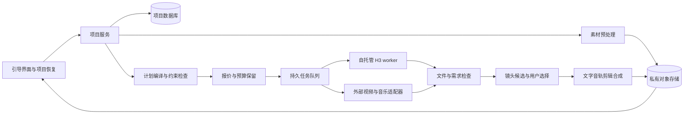

# 映序：实施方案与上线门槛

日期：2026-09-22。本文是可实施设计，不代表系统已经开发、供应商已经接通或产品已经上线。路线保持“先产品、后子网”：先证明用户可以完成有价值的短片，再考虑分布式供给。

## 1. 首发边界

首发目标是让小商家完成 **10–20 秒、单一用途、单一画幅**的商品或门店短片。一个项目可以只用真实素材与模板，也可以加入少量生成镜头。不强制三个镜头，不要求用户了解模型。

第一版可靠交付依赖四件事：事实确认、素材保真、镜头级修改、确定性合成。人物表演、动作迁移、视频/音频多参考属于单独验收后开放的能力，不能因为上传框接受这些格式就当作已经支持。

模型与流程证据见[能力研究](C:/Users/danmo/Desktop/inference/video-studio-design/research/capability-evidence.md)，场景与验收见[情景走查](C:/Users/danmo/Desktop/inference/video-studio-design/research/scenario-review.md)。

## 2. 建议的系统结构

初期用一个业务服务、一个数据库和持久任务队列即可。推理与渲染 worker 独立运行；不必先拆大量微服务。

可选实现组合：TypeScript Web 应用 + PostgreSQL + 支持重试和持久化的任务队列 + S3 兼容对象存储；Python worker 执行 ComfyUI 固定配方；FFmpeg 或等价渲染服务负责媒体标准化与最终合成。这是工程选型建议，可按团队现有经验替换。

ComfyUI 用作受控推理引擎。用户不能提交任意节点图、任意 Python 或任意自定义节点安装请求。配方由团队审核、固定版本并通过测试后发布。GPU worker 只拉取允许的素材与配方，生成结果回传业务服务。

所有供应商密钥只在服务端保存；浏览器通过短时上传凭证传文件。原文件与派生文件分开存储，按项目授权访问。暂时下载链接不作为产品的永久交付地址。

## 3. 数据模型与不可破坏的关系

所有主表包含 `id / created_at / tenant_id`；时间用 UTC，UI 按用户时区显示。费用存整数最小货币单位或明确精度的 decimal，禁止浮点数记账。计费货币、内部 GPU 成本、产品额度是不同单位，不能直接相加。

| 实体 | 核心字段 | 关键约束 |
|---|---|---|
| `project` 项目 | title、owner、purpose、target_platform、aspect_ratio、active_brief_version、status | 项目不等于单次生成；刷新、离开和恢复不会重建任务 |
| `asset` 素材 | object_key、sha256、media_type、duration、width/height、codec、source、validation_status | 原素材不可覆盖；转码和裁剪作为新派生素材；记录父素材 |
| `asset_use` 素材用途 | asset_id、role、subject_id、selected_range、crop、keep_original_audio、confirmation | 同一文件可承担不同角色；用途可修改但必须版本化 |
| `brief_version` 意图版本 | goal、audience、facts、hard_constraints、preferences、unresolved_questions、confirmed_at | 已确认版本不可原地修改；日期与售价保存确定值；OCR/AI 推测不直接当事实 |
| `storyboard_version` 分镜版本 | brief_version_id、shot_order、duration_target、audio_plan、text_layers、revision_reason | 分镜、字幕、音轨与素材用途均引用具体版本 |
| `shot_version` 镜头版本 | action、composition、asset_uses、duration、hard_constraints、recipe_id、status | “必须保留原商品图层”和“仅参考风格”不得被同义化 |
| `recipe_version` 配方 | capability_set、input_limits、model/revision、workflow_hash、quality_tier、tested_config、pricing_rule | 只有已验收且未禁用配方进入生产路由；模型升级生成新版本 |
| `quote` 报价 | plan_hash、line_items、currency、max_charge、included_attempts、pricing_version、expires_at、accepted_at | 素材/分镜/配方/候选数改变使报价失效；不静默提高上限 |
| `job` 逻辑任务 | project/shot/version、operation、dependency_ids、quote_id、status | 一个“生成该镜头”可对应多个明确记录的尝试 |
| `attempt` 实际尝试 | job_id、attempt_no、request_hash、provider、provider_task_id、dispatch_key、status、timestamps、failure_class | 提交不确定时进入 reconciliation；不当作失败直接重新付费提交 |
| `credit_ledger` 用户计费流水 | transaction_id、account、debit/credit、unit、amount、reason、quote_id、attempt_id、external_event_id | 追加写入、复式平衡、事件幂等；退款写反向流水，不改历史余额 |
| `provider_cost` 供应商成本 | attempt_id、estimated/actual_amount、unit、source、settlement_status | 供应商成本不是用户收费；平台承担重试时仍记录成本 |
| `result` 结果 | attempt_id、object_key、media_properties、sha256、checks、selection_status | 结果只有完成下载和校验后才可交付；预览与最终版分开 |
| `result_lineage` 结果来源 | result_id、parent_result_ids、input_asset_versions、recipe_version、seed、parameters、render_manifest | 能解释哪个素材经什么处理得到结果；保存实际使用模型，不只保存用户选择名称 |
| `feedback` 反馈 | project/result、reason_tags、comment、optional_timestamp、anonymous_session、source | 反馈不修改账单或触发无限重跑；匿名反馈单独分层分析 |

`credit_ledger` 的 reserve/capture/release/refund 应作为明确交易类型：确认报价后保留预算，达到收费条件后扣款，剩余额度释放。供应商完成不自动等于用户验收；具体收费策略由产品条款定义并在报价显示。支付系统入账回调同样必须唯一且可对账。

主键、外键与唯一索引之外，至少有这些数据库约束：

- `(job_id, attempt_no)` 唯一；`dispatch_key` 唯一。
- `provider + provider_task_id` 在已有 ID 时唯一。
- `external_event_id + event_type + provider` 唯一，重复回调不能重复结算。
- 业务写入、预算保留、outbox 事件在同一事务完成；worker 消费采用 inbox 去重。
- 项目级和报价级都有余额检查；并发点击两个按钮也不能同时透支。
- 已选版本不可因晚到的旧任务结果而覆盖；新结果进入候选列表。

## 4. 把意图编译成可执行计划

LLM 负责提取意图、提出方案、写用户能理解的镜头说明；确定性的校验器负责决定计划是否可以执行。不要让语言模型独自决定某个模型“应该支持”什么。

每条能力包含三类约束：

1. **输入限制**：支持的角色、数量、尺寸、时长、音轨、多人/单人等。
2. **语义承诺**：参考主体还是保留原图；动作参考还是精确复制；原音轨合成还是声音条件生成。
3. **运营约束**：实验状态、费用上限、地区/可用性、并发、超时、已知失败条件。

路由顺序应当是：满足硬约束 → 符合输入格式与能力 → 达到质量门槛 → 落在预算内 → 在剩余候选中优化速度和成本。便宜模型不满足硬约束时直接排除，而不是降低参考权重后继续。

示例：用户上传商品正面图，要求瓶子转一圈且标签绝对不变。系统检测到无法观察背面；不把“保持一致”加入提示词就继续，而是给出“保留正面并推进镜头”或“补充转台视频”的方案。用户未接受方案前不付费生成。

用户明确点名某模型时，`model_id` 成为硬约束；自动模式可以路由，但需披露实际使用模型，切换不会突破已确认约束或预算。暂时无法满足时保存项目并说明缺失条件。

## 5. 状态机、提交幂等和对账

### 项目与镜头

项目状态：`draft → needs_input → plan_ready → quoted → in_production → review → exporting → delivered`。项目可有部分镜头成功；一个镜头失败不把全项目清空。

镜头任务状态：`ready → budget_reserved → queued → dispatching → running → downloading → checking → review_ready`。旁路状态：`needs_fix / retry_wait / reconciling / rejected / cancelled / terminal_error`。

交互状态和实际供应商状态分别存储。浏览器进度条不是权威状态源；UI 从业务数据库恢复。队列位置未知时显示“等待处理”，不编造百分比。

### 一次正常提交

1. 浏览器提交 `intent_id + quote_id + plan_hash`，重复点击复用 intent_id。
2. 事务检查报价未过期、版本一致、额度足够；保留最高允许费用，创建 job/attempt 和 outbox。
3. worker 持有 attempt 租约；调用前记录唯一 dispatch_key。若供应商支持幂等提交，将同一 key 传给它。
4. 返回 provider task ID 后立即保存。轮询/回调仅更新此 attempt。
5. 成功后将输出复制到自有存储，检查解码、时长、音轨与清单；幂等写 result，再进入用户审阅。
6. 按公开收费规则结算并释放剩余保留额度。不会因为用户刷新或回调重送新增扣款。

### “请求发出后网络断了”的处理

本地 outbox 只能避免本地重复处理，不能替没有幂等接口的外部供应商保证恰好一次生成。提交可能已经成功但任务 ID 尚未返回时，标记 `reconciling`；先用供应商请求查询、组织用量或回调关联恢复。无法查清且供应商没有幂等提交时，停止自动再发，交给运营核对。不能把网络异常直接当作“未收费失败”。

### 重试规则

| 分类 | 动作 | 费用与用户信息 |
|---|---|---|
| 参数/素材不合法 | 修改输入后才新建尝试 | 指向具体素材与问题 |
| 临时限流/不可用 | 退避并加入随机抖动，设置次数/时间/预算上限 | 保留进度；报价内允许才自动尝试 |
| 执行异常且明确终止 | 同配方有限重试，记录新 attempt | 标明平台承担还是消耗已确认尝试额度 |
| 提交/终态不确定 | 对账，不立即重发 | “正在确认任务状态”，防止双重生成 |
| 供应商内容拒绝 | 不以换模型绕过拒绝；给可理解的修改入口 | 不承诺所有拒绝都没有供应商成本 |
| 生成可播放但不符合意图 | 作为质量返工，不伪装技术失败 | 新候选、新尝试和明确预算 |

取消请求区分排队与正在执行。已开始的任务可能完成并产生费用，先记录 `cancel_requested`，得到终态后再结算。相关供应商行为见[fal 队列说明](https://fal.ai/docs/documentation/model-apis/inference/queue)、[Runway 失败说明](https://docs.dev.runwayml.com/errors/task-failures/)。

## 6. 预览、局部修改与确定性合成

把预览拆为三个层级，避免“预览免费”或“预览和最终必然完全一样”的误导：

| 层级 | 目的 | 实际计算 | 用户如何确认 |
|---|---|---|---|
| 导演方案 | 确认故事、事实、字幕、素材用途 | 文字、分镜草图、原素材静态排版 | 不消耗视频生成额度；如有图像生成另行标价 |
| 动态候选 | 看动作、节奏、主体是否合适 | 支持时用较短/较低清生成，或直接生成可交付镜头 | 明确这一步成本；低清升级可能改变细节 |
| 交付预览 | 检查成片 | 已选镜头的剪辑、字幕、Logo、音乐、混音 | 与最终使用同一渲染清单；编码档位可不同 |

镜头与音轨形成依赖图：修改标题只让合成节点失效；改音乐只让混音与导出失效；改一个镜头动作让该镜头及其下游剪辑失效；改全片人物身份则可能让多个镜头失效。界面在执行前显示“将重做哪些内容，保留哪些内容”。

“保留这个镜头”通过版本选择与不可变素材保证；“只改这段生成画面中的手，其他像素都不变”则需要通过局部编辑模型单独验证。两种保留不能用同一句承诺混淆。

对必须准确的商品，优先原图/实拍视频剪辑。遮罩、轻微平移、缩放、背景、光效、文字及 Logo 采用可复现合成。准确品牌名、售价、日期、地址等由 confirmed facts 写入图层，渲染后核对文字与显示时长。文字渲染准确不代表商品包装在生成画面中也准确，验收时分开检查。

## 7. 时间与成本估算

### 可使用的真实锚点

旧测试为单张 Lium RTX 5090 32GB、约94GiB主机RAM、串行、固定 H3 FL2VA 量化与 LoRA 配方。约 5.17 秒 768p Turbo8：T2V 114 秒左右、I2V 127 秒左右；约15.08秒768p为743秒，480p为158秒。来源：[本地实测报告](C:/Users/danmo/Desktop/inference/h3-extended/REPORT.zh-CN.md)。

这些数不能推算 Ref2VA、其他机器、并发2、不同量化、不同分辨率的服务时延；不能由一次串行测试给出 P95。生产估算需要按配方、输入类型、时长、分辨率、冷热启动分桶更新。

### 内部估算公式

`单次有效 GPU 时间成本 = 实测秒数 × GPU小时单价 ÷ 3600`

`分摊空闲后的成本估计 = 有效时间成本 ÷ 利用率 u`

这里 u 定义为付费租赁时间中用于有效处理本产品任务的比例；这是简化成本模型，不适用于一边按该式分摊空闲、又把同一笔空闲费用再次相加。

`项目成本 ≈ Σ(各镜头尝试次数 × 单次分摊成本) + 图像/语音/音乐API + 预处理/合成 + 存储/流量 + 未包含的运营成本`

次数是实际收费尝试次数，包含最终没选中的候选。没有观测成功概率时，不用一个臆测概率宣称可以算准成片成本。

以历史价格 $0.65/GPU小时、114.083秒为**敏感性演算**，一次约5.17秒镜头的有效GPU成本约 $0.0206：

| 假设 GPU 利用率 u | 单次分摊GPU成本 | 三个镜头各生成两次 |
|---|---:|---:|
| 25% | $0.0824 | $0.4944 |
| 50% | $0.0412 | $0.2472 |
| 80% | $0.0258 | 约 $0.1548 |

以上全是假设利用率下的内部成本演算，不是当日机器报价、真实业务利用率、最终成片成本或建议零售价。尚未加语音、音乐、存储、渲染、人工和税。三镜头各一次串行推理约5.7分钟，各两次约11.4分钟，仍不含排队、预处理、下载、质检、用户决定时间与导出。并行可以缩短墙钟时间，但需额外 GPU；不能把一张已接近显存上限的5090直接设为并发多任务。

短片候选预算与最终导出预算分项显示。正式价格从版本化价格表计算，报价保存有效期与上限；每次实际账单再与供应商用量核对。不要拿自托管的纯 GPU 秒数成本与外部 API 含服务成本的价格直接声称同质量便宜若干倍。

## 8. 分阶段实施

| 阶段 | 做什么 | 退出条件 |
|---|---|---|
| A：当前设计验证 | 可交互原型、具体案例走查、邀请目标用户用自己的素材完成任务 | 确认主要阻碍和必需字段；不用模拟用户替代真人测试 |
| B：内部可运行纵切 | 一个商品/门店模板；真实素材→事实确认→分镜→一个生成配方→合成→导出；任务和费用账本完整 | 能恢复项目、局部修改、校验交付；故障注入通过 |
| C：限量试用 | 10–20秒单画幅；H3 已测短镜头配方；原素材保真模式；音乐与配音经各自验证后启用 | 达到下表硬门槛；已积累按场景的真实成本/耗时/接受率 |
| D：能力扩展 | Ref2VA、表演驱动、动作参考、更多供应商、语言与画幅 | 每个入口单独通过质量与可用性验收，失败能力可被关闭 |
| E：规模化与子网 | 将成熟配方的执行交给第三方 worker/矿工；保持项目、资产、报价和验收层不变 | 真实需求、单位经济、可审计供给和争议处理已有数据 |

每一阶段都保留 kill switch：按供应商、模型版本、配方或入口停用，已有项目继续可读和导出。能力未通过验收时显示不可用/试用状态，不让文案先于实现。

## 9. 上线 gate 与需要采集的数据

以下是拟议内部验收目标，尚未执行。业务转化目标与服务 SLA 必须由试用数据决定。

### 硬门槛：任一不通过就不开放收费

- 同一个生成 intent 重复点击、刷新、重送请求、重送 webhook 都不重复收费；并发余额不足不能透支。
- 提交后断网、worker 崩溃、结果下载中断、临时链接过期都有恢复路径；不把半个 MP4 当成已交付。
- 已确认售价/日期/地址/Logo 不会被 LLM 或 OCR 静默替换；无法满足素材约束时在付费前阻断。
- 用户确认预算上限后，任何自动重试都不能突破上限；版本变动后旧报价不可继续提交。
- 用户选好的镜头、原始素材和反馈不会被新结果覆盖；可以还原某次导出的完整来源。
- 承诺保持原素材的路径不能调用会重新生成该素材的模型；未通过验收的 Ref2VA/动作输入入口不可在正式产品开放。
- 私有素材不能跨账号读取；密钥不出现在浏览器、素材 URL、报错、前端日志和导出清单中。

### 工程验证矩阵

| 测试组 | 必测情况 | 记录字段 |
|---|---|---|
| 幂等与账本 | 双击、10次重复回调、乱序回调、并发报价、退款重复触发 | intent/attempt/event ID、保留/扣款/释放/退款、对账差异 |
| 任务恢复 | 提交前/后崩溃、无task ID的超时、处理中取消、下载中断 | 每一状态时间、provider ID、恢复动作、是否重复生成 |
| 素材处理 | 横/竖图、透明Logo、可变帧率视频、缺音轨、超时长、多人 | 实际媒体验证结果、派生关系、用户选择范围 |
| 语义路由 | 精确文字、缺少背面、原声保留、动作与镜头冲突、点名模型 | 约束集合、排除配方原因、最终配方、用户确认版本 |
| 输出质量 | 每个模板固定案例集与真实试用素材 | 技术通过、需求通过、用户接受分开；问题标签与时间点 |
| 媒体交付 | 逐帧解码、时长、尺寸、音轨、字幕区域、可下载 | 文件hash、检查版本、渲染清单、播放器检查 |
| 性能成本 | 冷/热、输入类型、时长、失败、重试、利用率 | 各阶段耗时、供应商费用、总成本、可接受成片成本 |
| 可用性 | 小白首次完成、无素材、错误上传、恢复项目、只改字幕 | 完成/放弃、求助次数、阻塞节点、首个可接受结果用时 |

建议每个要开放的核心模板先覆盖至少30个不同素材任务，失败类别都保留；该数量只是工程覆盖起点，不代表已证明某个稳定成功率。试用报告同时公布样本量、输入构成、返工率、接受率和成本分布，不只展示精选好片。

真人原型测试可先招募5–8位符合客群的用户逐个观察，找断点后修订，再招募新用户验证是否改善。这是定性研究起点，不足以估计市场需求比例或宣布“80%的人都会用”。上线后按模板统计任务完成率、最终接受率、每段接受结果的费用、返工原因和导出率。

技术文件成功率、用户任务成功率、用户满意度三个指标分别看。手动看过联系表不等于逐帧检查；ASR 台词正确不等于口型、音质或原声保留正确。

## 10. 先产品后子网：如何预留，哪些不能提前承诺

初期把自托管和外部 API 都放在同一 `ExecutionProvider` 接口后：`submit / status / cancel / reconcile / fetch_result / usage`。配方和输入输出契约固定后，未来矿工可以实现该接口，不需要把用户流程改成矿工市场。

现在就保存任务来源、配方版本、实际时长、文件hash、模型声明和结果关系，是为了审计和诊断。这些记录本身不能证明一个不可信矿工真的运行了所声称的模型。单看输出质量或风格也无法可靠证明没有换便宜模型。

赞/踩采用原因标签：身份不对、产品变了、动作不对、台词不对、画面问题、音乐不合适、只是个人偏好。允许匿名反馈，但匿名、已登录、已付费用户分别统计，并设防刷和限频。对路由效果做比较时须匹配场景、难度、预算和输入条件；直接比较不同人群的踩率会混入样本偏差。

反馈适合触发降低路由权重、质量抽检、增加人工复核或暂停供给，**不能单凭匿名点赞率/踩率自动罚没押金**。如果以后引入押金，需要明确可证明的违规条款、可复核证据、申诉期限与独立裁决；主观“不喜欢”不等于模型冒用或履约欺诈。

子网准入评测、随机对照任务、受控基准、运行环境证明等可以作为未来研究方向，不能在尚未验证时写成“已能验证模型真实性”。即使最终采用排放补贴，产品账本仍按实际成本核算，需看到补贴减少或消失时是否成立。

产品先证明：用户愿意为省心完成一支正确、可修改的短片付费。再决定哪些成熟工作负载值得交给矿工，以及哪种质量和结算机制能负责任地支持它。
