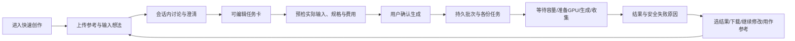
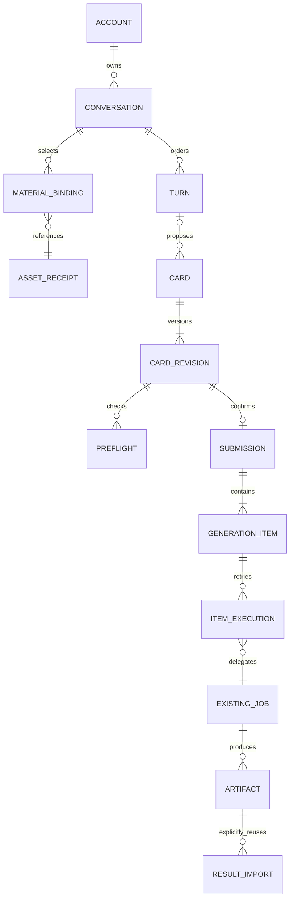
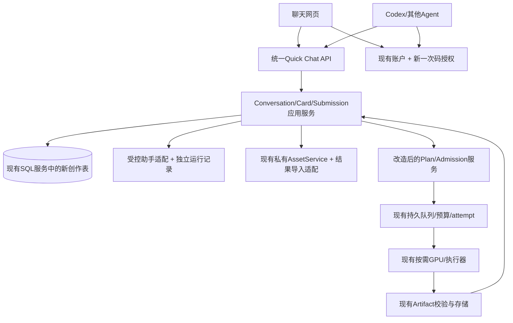

# 映序快速创作：产品与系统设计

日期：2026-10-05，Australia/Sydney。设计负责人：本会话。

本设计以用户认可的 `quick-chat-mock` 交互为体验基准，结合本地正式源码走查重新设计整条创作链路。它取代“把聊天页接到旧单镜表单”的实现方向。本文是待实现的设计，不能据此宣称功能或公网能力已经完成。

实际检查：mock交接、布局/交互/控制审查；`studio-app/src` 的快速创作、账户、素材、Agent、客户端；`h3-studio/studio_platform` 的认证、素材、计划、批次、队列、草稿、能力、Google实验适配、公开发现。中央仅查对应服务/profile与Gemini资源，未加载整个历史库。未查询生产健康、运行模型、启动GPU、部署或修改原任务/账本。

## 1. 产品边界与成功标准

用户来到一个聊天窗口，上传参考、描述想法，与助手讨论；形成完整可编辑任务卡后，明确确认生成。之后能看每份结果、解释失败、只重试失败项，或以某份结果为参考继续创作。用户无需先理解项目、章节、镜头、工作流图或GPU。

网页和Codex使用同一套创作命令与持久记录。网页不是Agent输出的文件浏览器，Agent也不是另外一套简化API。账户、费用和基础设施权限始终独立于“能创作哪些内容”。

首版不包含：多人团队/实时共同编辑、图像/音乐生成、Marble、H3未封装的重绘/延长/Turbo、双GPU策略上线。现有短剧工作台继续保留，不能由快速创作改版丢失旧故事或深链接。

## 2. 用户路径

桌面沿用左侧创作记录、主区单聊天线程、底部输入框。API Key与Agent入口固定侧栏底部、账户上方。窄屏将记录折叠为抽屉，不压缩任务卡为难以操作的多列。

未登录时可在本地选择文件、编辑文字；明确标“尚未上传”，不偷用上一个账户。首次登录建立新会话并带入当前想法，不跳到某个旧故事。浏览器File对象只在当前页暂存，刷新/关页会丢失未上传文件，必须预先提示；文字草稿按匿名/账户/会话分别保存并与服务器已保存状态区分。

登录后才创建会话和上传；重登账户不同必须重新确认待上传材料，不能自动把旧账户待传文件提交给新账户。切会话的文件保留原暂存归属，不跟着当前选择移动；上传中切换只中止浏览器等待，服务器已接收收据仍归原会话，回原会话核对同ID。反馈分别说清“已保存文字/上传完成/已排队”，不使用模糊成功toast。

普通讨论只调用文本助手，不建立视频任务、不租GPU。卡片生成和预检也不租GPU。确认生成才形成业务执行义务，底层调度自行决定开机与分配。

## 3. 创作数据的唯一来源

### 数据关系

| 实体 | 权威内容、关联与不可变边界 |
|---|---|
| Conversation | owner/tenant、标题、版本、下一轮模型/参数、材料选择、更新时间；不保存浏览器Cookie/供应商Key |
| Turn | 持久单调seq、用户原话、选定准确model ID、完整输入/设置/上下文快照、助手运行状态、回复/错误、来源actor；同一会话只能有一个未解决的助手运行 |
| MaterialBinding | 对已验证Asset收据的会话引用，binding_id/version、参与/不参与、用途、选段、视频原声、时间锚点；会话材料catalog完整持久，input_refs只从启用的binding派生；移除引用不删除原件 |
| Card | 名称、所属会话/轮次、current_revision、来源关系；可以由助手、用户或Agent创建 |
| CardRevision | 完整prompt/recipe/controls/inputs/copies、各份uint64种子、引用收据与选段快照、内容hash；保存即不可变，编辑产生新revision |
| Preflight | revision/hash、每份plan、规格、费用预留、限制/警告/到期、能力与执行配置身份；不等于已排队 |
| Submission | 对一个revision的一次明确生成确认；唯一绑定revision，不因换浏览器/Key/调用者建立第二批 |
| GenerationItem | 第几份、固定seed、执行历史、当前job、输出；批次部分失败不抹掉成功份 |
| ItemExecution | 重试编号、plan/job/请求hash、停止证据、安全错误；旧执行保留，未知执行不能再次发起 |
| ResultImport | 明确选择artifact成为参考的CPU处理收据和来源；处理成功才得到可用于H3的asset_id |
| TimelineEvent | 创作提交、卡片/版本、预检、确认和引用来源的持久事件；seq分页用于重登/Agent同步。执行变化与结果来自关联submission/job的当前DTO，首版不假设它们自动推进seq |

原AssetService、任务/attempt/产物、租赁与预算表继续作为底层权威。新会话/卡片表是创作权威，不把现有项目JSON镜头和新卡片当两份可任意独立写的当前数据。

### 执行投影与旧接口保护

现有素材/预算/任务按project归属，因此会话创建一个隐藏执行容器；用户不需要创建故事。每个不可变卡片revision的每一份有稳定执行源标识，投影为既有计划编译器需要的镜头结构。这是内部适配，不是用户或Agent编辑入口。

执行容器必须持久标记 `integration_kind=quick_chat`、会话ID、revision/item/source hash。对这种容器，旧项目PUT/actions、旧直接计划/批次创建不得绕过新创作命令；返回明确 `quick_chat_managed_resource` 和新API入口。旧故事/旧快速创作仍走旧接口。读取、下载、资产授权可复用；取消由统一命令委托底层，不能取消时谎称已停止。

投影可以按不可变revision重建，但不得覆盖已确认任务，也不能静默修补source hash。提交发现投影与revision不一致时拒绝并保留原数据，进入可解释的恢复状态。

### 幂等、并发与执行归属

所有创建/确认命令要求稳定Idempotency-Key、规范化请求hash；同key不同内容409。重放检查先于版本检查，丢响应后原key/原body应恢复原结果。

更新会话/卡片head要求expected_version。冲突不得覆盖；网页保留未保存文字，提供载入远端或保存为另一版本。

**确认生成的业务唯一性不依赖actor_id。** 用 `(tenant, owner, card_revision_id)` 唯一提交记录串行化网页和所有Agent竞争；记录真实确认actor作为审计。队列幂等namespace使用持久submission/item身份，权限检查仍使用当前调用者。不能通过临时伪装Principal把业务身份和授权身份混在一起。

任务和链接先持久为inert/planned，再入队。进程在任一边界中断，恢复同submission/item，不另建任务；若未确认上游结果，只对账。单份重试必须明确失败/取消、已证明上游停止且无活跃租约；使用新ItemExecution、相同原输入与seed；想改变seed或参数属于新revision，不叫重试。

重试也有跨调用者业务唯一约束 `(tenant, owner, item_id, retry_of_execution_id)`，锁item并CAS current_execution；不同Agent用不同key点击同一旧失败执行，仍只形成一个新execution/job。从未准入的item或未入队planned job走独立resume-admission：新预检只覆盖这些item，恢复原submission/item及已存在job，不触碰成功/运行/unknown项。不能因唯一submission把被拒绝份永久锁死，也不能整批重投。

hash分层：revision保存requested_input_hash（原收据SHA/选段/显式参数）；preflight保存resolved_execution_hash（裁片收据/实际默认/模型/能力/运营policy）；执行投影另用source_snapshot hash校验。CPU派生发生在预检时，不能随后写回不可变revision。新预检到期替换只生成另一条收据。

## 4. 助手行为与上下文

默认准确ID `gemini-3.8-flash`，可选 `gemma-4-31b-it`。不能把显示名当ID、静默换模型或把模型目录可见写成生成已验收。

助手输出结构是 `reply + intent + optional proposed_card`。讨论/解释通常不出卡；明确生成或改片意图且必要信息完整才提出卡片；关键歧义只问必要问题。用户也可不调用助手，明确“创建任务卡”，或让外部Agent直接写卡片。

模型输出只是一份建议。服务端严格解析允许字段、校验素材收据和H3控制，不执行模型提供的API路径、工具指令、计费或基础设施动作。卡片prompt须完整可独立执行，不能仅把历史文本串接成“新提示词”。

上下文采用本会话已提交轮次 + 最近相关卡片完整内容 + 本轮显式材料/参数；保存使用的turn/revision IDs及hash，便于解释“继承了什么”。上一轮未要求改变的内容保留；生成结果默认不进入参考。超出上下文上限必须显示，首版不暗中截断或用未经验证摘要丢信息。

普通发送默认assistant_mode=assist，由受限语义输出选择讨论或建议；前端不靠问号/关键词正则判断是否出卡。discuss只讨论，none仅保存输入。propose是助手输出的intent而不是每次发送强制生成卡片。

用户文字先持久；助手调用在SQL事务之外。状态区分pending/running/completed/failed/unknown，不用定时假回复；超时视为可能已消费文本额度，禁止自动换模型或重发。新的明确调用需要新的turn；未知调用保留原输入并提示，不能刷页面再次扣费。用户可明确承认旧回复未知、解除该会话运行阻塞并发起新turn；不谎称旧调用已失败或已免费重试。

当前Google实验适配只有文本输入。正式多模态理解是独立**必须验收的工作包**：仅从账户授权且服务端验证的素材/明确选段读取，经受限payload发给支持该输入的准确模型；网页显示助手实际看到了哪些素材。每次AssistantRun保存media_input_manifest（binding/asset/hash/range、实际类型、sent状态与未发送原因），材料旁区分“供H3参考 / 助手已读取 / 助手未读取”。

schema按模型分别发布text/image/video/audio的implemented/verified/enabled和输入限制；目录可见不是媒体理解证据。不能只发送文件名/元信息就声称看懂人物动作，也不能默认Gemma拥有与Gemini相同媒体能力。未验证时明确缺口，可手工/外部Agent写卡片，但“首图/动作参考的助手创作体验”不能验收为完整。文本调用默认未启用，真实媒体/文本模型测试需另行授权；本轮离线测试不使用真实凭据。

## 5. H3控制与材料体验

下一轮参数与单张卡片参数分离：输入区高级按钮只改下一轮；卡片编辑产生该卡新revision。已提交快照不可改变。关闭弹窗取消未保存更改。

设置分组：常用方式/时长/清晰度/画幅/份数/声音 → 参考和时间 → seed/steps/sampler/scheduler/denoise → shift_video/audio → 解码/编码/导出。首版抽卡copies为1–4的产品限制，不伪称模型原生批处理。

参数由模型API schema与当前execution_support的交集决定：4–15秒、真实480P/576P/768P/custom枚举，uint64字符串seed、自定义宽高约束、视频include_audio、结构化guides、原文件选段。省略的内存参数采用公开部署预设；用户显式改值保留，预检可拒绝，不能静默覆盖。

基础9图/3视频/3音频/总12与当前池更严限制分层显示。长原件可先上传和讨论，再选合法片段用于生成。首尾帧与普通ref互斥，但guide独立能力须查当前recipe，而不是一刀切删除。切换方式时说明哪些材料本轮不参与、保留原件，显式确认；无材料自动方式解析为fl纯文本。

结果“用作参考”先产生真实ResultImport，核验内容/格式/大小/时长及来源权限，再复用AssetService的素材处理与份额机制。视频通常还需明确选段。跨会话不得直接粘贴对方asset_id；显式拥有者授权的导入产生新会话绑定与来源记录，不能靠任意URL下载或放宽跨账户读取。

## 6. 用户可理解的执行状态

| 用户看到 | 底层事实 | 操作 |
|---|---|---|
| 待完善 | 草稿缺输入/参数 | 编辑或讨论，不产生任务 |
| 待确认 | 预检通过但没有确认 | 查看全批费用/规格/材料/等待原因后确认 |
| 等待算力 | 同一job已接受、无可用worker | 自动等待；显示库存/期限/预算等安全原因，可请求取消 |
| 正在准备GPU | 已登记租赁，runtime未就绪 | 真实阶段和更新时间；不编造百分比/固定ETA |
| 正在生成 | 同一attempt运行 | 保留输入快照与job链接，可请求取消 |
| 正在收集结果 | 上游产物完成，校验/入库未完成 | 等待；不能提前声称成功 |
| 完成 | 产物校验与账户入库完成 | 预览/下载/继续修改/显式用作参考 |
| 失败可重试 | 明确失败、停止证明与恢复条件满足 | 单项重试；其他成功份保留 |
| 结果待确认 | 上游提交/停止/账单不确定 | 保留原任务、自动只读对账，禁止重投 |
| 取消处理中 | 收到取消意图，未证明停止 | 保留状态；已发生计算可能仍计费 |

网页首版将两条读取分开：timeline seq取持久创作事件，活跃submission独立有界轮询关联job与结果。即使latest_seq不变，GPU准备/完成/失败仍须刷新；GET不补写timeline。服务端批量查询有权job，避免每张卡每个item一条N+1请求。以后如加执行事件，须由队列outbox消费者按source_event_id去重并持久checkpoint，不能由读接口制造。页面显示真实“最后更新”，无连接时不伪装生成中。

## 7. 一次性连接码：最新主流程

网站登录 → 点击连接Codex → 创建5分钟连接码并复制公开说明 → Agent用公开Skill下载的helper本地连接 → 网站显示已连接、Key用途/访问范围/最近使用 → 用户随时撤销。

连接码是短期凭据，不在URL、服务日志、分析事件或正式报告中出现；仅用户明确操作显示/复制。复制说明说明有效期与广泛创作权限，不把它宣传成无风险分享链接。

采用**客户端先安全生成并保存正式PAT，再注册hash**，服务器不返回正式Key：Agent本地产生高熵PAT和随机verifier，先写OS凭据库；交换一次码、token_hash、prefix与SHA256(verifier)。服务器在同一事务内消费code并注册一个现有PAT记录，固定原owner/权限/有效期，不接受兑换方变更scopes或签发更多Key。

首次结果不明，Agent保留同PAT与verifier，在短恢复窗口内证明verifier以读取同一个连接结果；不能生成第二把Key。过期未注册或不可恢复，必须撤销/重新授权；本地待授权凭据不可宣称有效。

Windows使用用户DPAPI，Linux/macOS使用经检查的OS凭据库；没有安全存储则明确停止，不降级普通JSON。**公众不依赖我们内部AI-Registry。** 内部供应商凭据仍只经中央加载器/已授权服务器来源使用。

发码时冻结授权profile_id/version、确切scopes、项目范围、owner/tenant和PAT期限，不能兑换时读取“当时的全部API_SCOPES”。新上线assistant:run不能自动扩旧码或旧Key。公开说明带非秘密authorization_fingerprint，兑换方只能断言这个fingerprint而不能改授权；成功响应包含原固定授权快照，helper确认origin/账户/fingerprint后才标connected。

代码/兑换/恢复均有源与连接ID限流、原子竞争保护、权限与密码版本校验、脱敏审计。浏览器创建/撤销需要登录与同源校验；Bearer机器身份不能创建新连接码。兑换使用TLS，开发仅loopback例外；跨站浏览器写入仍拒绝，非浏览器Agent可匿名POST兑换，不因为公开此路由就放开其他写API。

默认广泛创作权限覆盖本人所有现有/未来内容与创作命令，不允许读他人内容、改供应商凭据、部署/租赁策略/账户预算或自动充值。撤销连接同时撤销PAT，阻止后续调用；已接受任务仍按原生命周期处理，不随撤销丢任务。手动PAT仅高级备用，旧配置教程不再是主流程。

## 8. 架构与职责

不通过服务器请求自己的HTTP API串起业务；抽出被新旧路由共用的纯应用服务。新路由负责账户/权限、参数和错误；应用服务负责业务唯一性、快照、事务与恢复；执行器只接受已授权、已验证的不可变任务。

初期继续单体CPU服务与既有SQL/对象存储，不为新聊天另租数据库、建平行GPU调度或迁移对象。新增表是增量schema，部署迁移必须可在新旧代码兼容窗口内运行；不能重写已有成功任务或重新计费。

## 9. 保留、改造、重写的决策

| 现有能力与源码证据 | 决策 | 原因/实施要求 |
|---|---|---|
| `auth.py` 账户/session/PAT | 保留核心、增加连接授权服务 | 既有owner隔离、密码版本、撤销可复用；旧手工教程不是新主流程 |
| `assets.py` / 私有ObjectStore | 保留、增加result import | 条件创建、上传日志、解码与配额已有；artifact.adopt不等于可作H3参考 |
| `generation_draft.py` / `capabilities.py` / Comfy编译器 | 保留底层校验、做执行投影适配 | 不让镜头/项目JSON成为新卡片第二权威 |
| `api.py` plan_response/create_from_plan | 抽应用服务 | 闭包和Principal actor耦合不适合跨网页/Agent提交唯一性 |
| `batches.py` BatchService | 改造业务身份与关联/恢复 | 当前unique含actor_id；不能直接用旧POST当新卡确认 |
| `repository.py` job/attempt/预算 | 保留原语、增加明确business namespace入口 | 不修改旧namespace语义/历史任务；新submission唯一性上移 |
| GPU scaler/bootstrap/queued runner | 保留 | 新体验不需租赁重写；缺货/未知保护和任务事实不绕过 |
| `google_chat.py` / chat_model_lab | 仅复用供应商请求适配；重写会话/运行/结构化建议层 | 当前文本、内存实验不支持持久创作、媒体理解或生产幂等 |
| `Freestyle.jsx` / CloudShotPanel | 重写快速创作产品层，保留旧深链 | 当前信息结构是选云项目/镜头+表单；不是单会话创作 |
| cloud-client账户fence、素材预览、参数schema | 可选择复用工具，避免依赖旧store.current | 切账户清理与下载安全有效；旧项目controller不适合会话导航 |
| AgentConnect旧教程/agent discovery | 重写主流程与扩充公开Skill | 一次码已取代旧教程；公开文档必须对齐新统一命令 |
| mock内存history/拼接回复/定时进度/假视频 | 不复用 | 只能当体验参考，正式状态全部来自持久服务 |

## 10. 五个真实场景验收

1. **首张人物图做广告**：进入即选图/输入；登录后存会话，不问章节；先讨论再出卡，确认前无job/GPU。刷新重登材料和回复仍在。
2. **“镜头近一点，其他不变”**：新turn记录继承来源，未改变人物/音轨/背景保留；新卡包含完整prompt；旧已提交输入hash与结果不变。
3. **抽四份，成功两份、失败一份、unknown一份**：独立种子/状态/下载；只对已停止失败份重试；unknown不租替代机、不双投，网页+Agent同时重试同一动作只出现一个新execution。
4. **Codex与网页同时确认**：同revision只出现一submission/各份job，真实caller审计都可见；Agent编辑新版本网页能读回，本地未保存草稿不被轮询覆盖。
5. **结果继续创作与撤销Agent**：明确选result→CPU导入合法素材→明确选段→新卡引用；不自动引用输出、不跨会话偷用收据。撤销Agent阻止新写入，但已接受job/产物仍完整可见。

此外验证跨owner/tenant、错误模型不降级、过期预检、重复/并发兑换、丢响应恢复、密码轮换、能力变更、任意URL/提示注入、uint64大seed和长参考片段。测试使用临时库与假供应商边界，不把模拟当线上模型或GPU验收。

## 11. 分批实施与验收出口

先落实配套 `QUICK-CHAT-API-CONTRACT.zh-CN.md` 与 `QUICK-CHAT-IMPLEMENTATION-BACKLOG.zh-CN.md`，再按纵向切片交付。每批包含网页、Agent API、持久数据与故障验收，不先堆组件再寻找如何串联。

本地集成与一次集中回归完成后给用户验收。新媒体/聊天页面仍未经生产发布授权；不sync `h3-studio/yingxu`，不push main触发部署，不改正在运行的服务、预算、期限和已提交任务。发布是后续独立动作。
